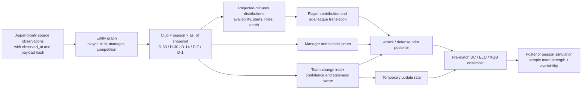

# Off-season model-improvement audit

**Date:** 2026-07-30 (America/New_York)

**Scope:** preseason and early-season football forecasting; research only

**Repository:** `/Users/ryangerda/Development/MLS`

**Specification:** `offseason_feature_engineering_spec(1).html`

**Production status:** no model, feature, simulator, champion pointer, or production payload was changed

## Evidence labels

- **Measured** means computed from this repository or its cached data during this audit.
- **Repository fact** means directly supported by current code, metadata, or a recorded experiment.
- **Verified external** means checked against an official or primary source linked here.
- **Inference** means a conclusion from those facts, not a directly observed field.
- **Forecast** means an expected effect or cost to be tested, not a result.

## Executive verdict

The best off-season improvement is not another season-static XGBoost column. It is a point-in-time player-and-club state layer that can update preseason attack, defense, uncertainty, and early-season learning rate. The repository already tested the easy static formulations—roster delta, spending, squad value, value × age, manager tenure, minutes concentration, rest/travel—and they mostly lost. Those failures reject the old measurements and placements, not the underlying football mechanisms.

Three conclusions dominate:

1. **Fix the evaluation contract before judging another winner.** The champion pointer references a report path that was overwritten after promotion; the default harness does not reproduce the four-fold bagged champion; and the season-outcome replay silently assigns empty sets to several production bucket types. A model can currently be compared against the wrong champion or receive artificial zero loss on promotion and playoff-title rows.
2. **Historical point-in-time data is the binding constraint.** Local roster, transfer, salary, injury, tactical, news, and odds files generally do not reconstruct what was known 60/30/14/7/1 days before historical openers. Backfilling a final roster or a later-corrected source would manufacture a favorable but invalid backtest.
3. **Use off-season information to change latent state and uncertainty.** Returning projected-minute share, replacement quality, positional continuity, integration time, manager/squad fit, and player workload should first produce a distribution over preseason attack/defense. A team-change index should widen that distribution and temporarily increase the update rate. Only genuinely match-specific style interactions belong as raw match-model features.

Measured diagnostics do **not** establish a general opening-ten-week crisis. On the current MLS frame, the canonical replay scores 0.635704 in each club's matches 1–5, 0.630158 in matches 1–10, and 0.633295 after match 10. The first-five estimate is worse, but its four-season block interval is wide, `[0.623667, 0.648433]`; the first-ten result is actually better than later matches. The campaign should therefore target identifiable high-change clubs, not impose a league-wide opening penalty.

One baseline input deserves quarantine until timing is proved. ESPN final active-match rosters improve aggregate Brier by 0.001051 at seed 42 but only 0.000381 at seed 7. They worsen matches 1–5 at both seeds: removing them improves that slice by 0.000923 and 0.002410. The cache has no publication timestamp and was collected retrospectively. Predictive usefulness does not make it safe for a D−1 forecast.

The only new architectural A/B that is currently both inexpensive and defensible from existing aggregate data—the Big Five value-informed preseason location tilt—continues to improve relegation and UCL outcomes at two seeds, while slightly hurting title Brier. It remains a simulator-only, preseason-only result with material licensing/provenance limitations; it is not evidence for adding raw squad value to the match model.

## 1. Repository orientation and governing decisions

The requested governance and research documents, active plan, model, evaluation, feature, simulator, reporting, promotion, ingestion, cached-data, and experiment paths were read before any audit code was added.

There is one workflow conflict. `docs/experiment-protocol.md` still contains historical branch language, while the newer canonical decision in `CLAUDE.md:25-28` says development occurs on `main`. This audit follows the newer decision. The worktree contained extensive unrelated user changes; they were left untouched.

Current season rules are:

- train on 2017 onward;
- exclude 2020;
- retain 2021 as training data and the 2022 calibration fold;
- test 2022, 2023, 2024, and 2025;
- never treat 2026 as a completed held-out season.

These are stated in `CLAUDE.md:34-48` and `docs/CURRENT_STATE.md:131-145`.

## 2. Current model and exact baseline

### 2.1 Champion contract

| Component | Exact contract |
|---|---|
| Dixon–Coles | Four most recent seasons; exponential 120-day half-life; fitted attack/defense, home advantage, and low-score `rho`; parameter bounds in `models/research_model.py:30-36,85-105`. |
| ELO | K=25, home advantage=80, 40% season-boundary regression. MLS regresses toward 1500. European production additionally uses a three-season club prior with beta 0.75 and bidirectional tier bridges; see `scripts/eval/elo.py:16-24,92-154` and `docs/CURRENT_STATE.md:27-39,141-145`. |
| XGBoost inputs | 37 columns: home/away/difference ELO; xG and xGA at 3/5/10/15 matches; xG difference/sum; result form at 3/5/10/15 and difference; goalkeeper z-scores; playoff flag; ESPN active-roster availability share. Exact list: `data/parity_frame.meta.json:2-39`. |
| XGBoost weighting/grid | Season half-life 6. Inner validation uses the last two training seasons. Narrow grid is depth {3,4,5} × trees {200,400} × learning rate {.05,.10}, with subsample and column sample 0.8. Code: `models/research_model.py:175-231`. |
| Seed bag | Five XGBoost members, seeds 42, 1042, 2042, 3042, 4042; raw probabilities averaged before calibration (`models/research_model.py:181-236`). |
| Calibration/ensemble | Separate scalar temperature calibration for DC and XGBoost; calibration-fold Brier chooses XGBoost weight in `[0.7,1.0]`; a second scalar temperature is fitted to the blend (`models/research_model.py:145-167,239-305`). |
| Walk-forward | For test season `S`: train `< S−1`, calibrate on `S−1`, test on `S`. Minimum 200/50/50 rows (`models/research_model.py:259-317`). |
| Headline metric | Multiclass **sum-form** Brier. Uniform probabilities score `2/3 = 0.666667`. Equal-fold average is the headline; pooled Brier is separately useful. |

### 2.2 Frozen promotion evidence and artifact drift

The canonical promotion pointer, `experiments/champion.json:2-6`, records:

- run `challenger-bag5-07c8442c-20260610T010824`;
- equal-fold average Brier 0.632977;
- promotion at `2026-06-10T01:08:24Z`;
- explicit owner override because the 0.000494 gain missed the 0.0005 gate by 0.000006 while calibration approximately halved.

The matching metrics survive in `experiments/b4-trust-baseline.report.json`:

| Metric | Frozen June champion |
|---|---:|
| Matches | 2,072 |
| Equal-fold Brier | 0.632977 |
| Pooled Brier | 0.632997 |
| Log loss | 1.051003 |
| Accuracy | 0.473456 |
| Home/draw/away Brier | 0.244089 / 0.191950 / 0.196958 |
| Pooled all-class max decile error | 0.018206 |
| 2022 / 2023 / 2024 / 2025 Brier | 0.630827 / 0.634671 / 0.634913 / 0.631495 |
| Coverage | 489 / 521 / 522 / 540 |
| XGB blend weight | 0.700 / 0.930 / 0.700 / 0.872 |

The pointer's target file, `experiments/challenger-bag5.report.json`, was overwritten on July 11 with a different run: equal-fold 0.633083, pooled 0.633117, max calibration error 0.019934, and fold scores 0.629941/0.635596/0.635476/0.631319. `scripts/promotion_gate.py:58-65` loads only the mutable path and does not validate the pointer's run ID or digest. **Repository fact:** the operative gate no longer loads the report that was promoted.

### 2.3 Current-code replay

Command run:

```bash
venv/bin/python scripts/model_report.py \
  --frame data/parity_frame.parquet \
  --out experiments/offseason-audit-baseline-2026-07-30.report.json \
  --label offseason-audit-baseline \
  --test-seasons 2022,2023,2024,2025 \
  --n-bags 5
```

The current frame hash is `20f9edb323ec0585`; current Git HEAD was `f94ba275`. This is a **replay of current code/data**, not a replacement for the immutable June promotion evidence.

| Metric | Current-code replay |
|---|---:|
| Matches | 2,072 |
| Equal-fold Brier | 0.632413 |
| Pooled Brier | 0.632438 |
| Log loss | 1.050170 |
| RPS, ordered H/D/A and normalized by `K−1` | 0.220299 |
| Accuracy | 0.473456 |
| Home/draw/away Brier | 0.243850 / 0.191839 / 0.196749 |
| Equal-width one-vs-rest ECE | 0.011487 |
| Whole-season bootstrap Brier interval | `[0.630445, 0.634405]` |
| 2022 / 2023 / 2024 / 2025 Brier | 0.629968 / 0.634213 / 0.634596 / 0.630877 |
| XGB blend weight | 0.700 / 0.938 / 0.700 / 0.845 |

The original reporter's `max_decile_cal_error=0.027445` uses a different pooling/minimum-bin convention from the diagnostic ECE above. These values must not be compared as if they were the same statistic.
Neither the frozen report nor the current standardized reporter stores multiclass calibration slope/intercept; they are explicitly **unavailable** for this baseline and are required in the revised reporting contract below.

### 2.4 Early-window and structural-break baseline

Research-only code: `scripts/eval/offseason_early_slices.py`. A match is in club matches 1–N only when both clubs are playing their Nth-or-earlier match; this is chronological club match number, not an official MLS round.

| Cohort | n | Brier | Log loss | RPS | ECE | Season-block 95% Brier interval |
|---|---:|---:|---:|---:|---:|---:|
| All | 2,072 | 0.632438 | 1.050170 | 0.220299 | 0.011487 | `[0.630445, 0.634405]` |
| Club matches 1–5 | 279 | 0.635704 | 1.055195 | 0.217776 | 0.019906 | `[0.623667, 0.648433]` |
| Club matches 1–10 | 566 | 0.630158 | 1.047083 | 0.215233 | 0.015346 | `[0.616142, 0.642726]` |
| After club match 10 | 1,506 | 0.633295 | 1.051330 | 0.222204 | 0.016599 | `[0.629391, 0.637391]` |
| Involves a new-manager flag | 508 | 0.631697 | 1.050261 | 0.223951 | 0.033814 | `[0.605724, 0.649113]` |
| No new-manager flag | 1,564 | 0.632679 | 1.050140 | 0.219113 | 0.009359 | `[0.628352, 0.636875]` |

**Inference:** raw new-manager presence is not an observed weakness in these four seasons; calibration is less stable in that cohort. The small number of seasons makes the intervals descriptive, not promotion evidence.

### 2.5 Availability timing sensitivity

`home_avail_share`, `away_avail_share`, and their difference are built from ESPN final active matchday rosters and prior-season player xG+xA (`scripts/eval_baseline.py:1711-1831`). The local `data/espn_rosters.csv` was fetched retrospectively from an undocumented ESPN endpoint (`data_pipeline/espn_rosters.py:1-15,25-31`) and contains no `observed_at` or provider update timestamp.

Coverage is 95.5%/95.2%/96.2% for home-team rows in 2022/2023/2024 and 0% in 2025; missing coverage is encoded as exactly `1.0`, not null. The existing feature-completeness report therefore cannot detect the 2025 absence.

The research-only removal command was:

```bash
venv/bin/python scripts/eval/offseason_early_slices.py \
  --drop-feats home_avail_share,away_avail_share,avail_share_diff \
  --out experiments/offseason-audit-no-availability-2026-07-30.json
```

| Cohort | Seed 42: with → without (`Δ`) | Seed 7: with → without (`Δ`) |
|---|---:|---:|
| All | 0.632438 → 0.633489 (+0.001051) | 0.632994 → 0.633375 (+0.000381) |
| Club matches 1–5 | 0.635704 → 0.634781 (**−0.000923**) | 0.636599 → 0.634189 (**−0.002410**) |
| Club matches 1–10 | 0.630158 → 0.630325 (+0.000167) | 0.630738 → 0.629798 (**−0.000940**) |
| After club match 10 | 0.633295 → 0.634678 (+0.001383) | 0.633841 → 0.634720 (+0.000879) |
| New-manager cohort | 0.631697 → 0.631972 (+0.000275) | 0.633110 → 0.632416 (−0.000694) |

The later-match direction is stable, but the aggregate magnitude is seed-sensitive and the early-window result runs the other way. More importantly, the current cache cannot prove that its final active roster was available at the product's forecast cutoff. The correct response is to define a product horizon—e.g. D−1, T−60 minutes, or post-lineup—and collect timestamped roster forecasts/confirmations separately. It is not to pretend that the retrospective cache is D−1 safe.

A paired whole-season bootstrap of `without − with` reinforces the caution. Aggregate 95% intervals are `[+0.000240,+0.001661]` at seed 42 and `[−0.000357,+0.000854]` at seed 7. First-five intervals are `[−0.004631,+0.001225]` and `[−0.004172,−0.000485]`; after-match-10 intervals are `[+0.000474,+0.002216]` and `[+0.000131,+0.001594]`. With only four seasons these are descriptive, but later lift is more stable than aggregate or early lift.

### 2.6 League families and coverage tiers

The repository correctly treats league families separately:

| Family | Recorded result | Important difference |
|---|---:|---|
| MLS | 0.6330 frozen champion | Full DC + bagged XGB; MLS-only GK and availability features. |
| NWSL | 0.6458 | XGB-only (`dc_blend_floor=1.0`); DC was a measured liability. |
| USL Championship | 0.6246 | Separate family fit and sparse-data behavior. |
| Big Five | 0.5934 | Generic league ELO/xG/form/playoff features; European preseason priors and value tilt in the simulator. |
| Goals-only European tiers | 0.6152 vs naive 0.6498 | Goals substitute for xG; tier bridges; higher preseason variance. |
| Other goals-only leagues | Coverage-first | Generic ELO/goals/form, league-specific format rules where implemented. |

European family reports are not comparable in evidentiary strength to the MLS report. `scripts/build_family_report.py` aggregates mutable web payload diagnostics, equal-weights league-season cells, uses league count as coverage, and carries no immutable data hash, calibration slices, or per-match predictions. The league builder's diagnostic path uses one XGB bag rather than the five-member champion. Missing fields cause several promotion checks to skip.

### 2.7 Season simulation

Production match/game-card probabilities use the ensemble, but remaining-fixture season simulation uses **DC plus temperature**, not the full XGBoost ensemble (`scripts/build_league_data.py:1732-1760,1794-1806`). Production runs 20,000 Monte Carlo seasons at seed 42. Per-simulation team-strength perturbations decay as:

```text
sigma_effective = sigma_source_family × (1 − season_fraction)
```

with Big Five/Understat `sigma=60`, football-data/tier leagues `sigma=90`, and default 60 (`scripts/eval/sim_variance.py:35-90`; `scripts/build_league_data.py:1903-1915`). Big Five preseason fixture logits also receive a beta 0.5 value-to-ELO location correction for all clubs.

Two simulation audit issues matter:

- The frozen replay includes 2020, contrary to the current protocol.
- Replay `bucket_members()` understands only `top`, `bottom`, and `band` (`scripts/eval/season_outcomes.py:92-100`). Production separately implements composite promotion playoffs, championship playoffs, and per-conference qualification (`scripts/build_league_data.py:1191-1301,1928-1948`). The replay therefore records all-zero predictions and labels for pooled `promoted` rows and NWSL `title` rows; USL conference qualification is also not faithfully reconstructed.

Any affected outcome must be marked unavailable and excluded from pooled gates until the replay shares production bucket logic and has historical playoff/conference truth.

For orientation only, the protocol-season replay run in this audit (3,000 simulations, seed 42, 2018/2019/2021–2025) produced:

| Outcome | Preseason | 25% | 50% | 75% | Interpretation |
|---|---:|---:|---:|---:|---|
| Conference qualification | 0.0500 | 0.0484 | 0.0406 | 0.0353 | Ordinary rank bucket; advisory across mixed families. |
| Europa qualification | 0.0483 | 0.0444 | 0.0403 | 0.0321 | Ordinary rank bucket. |
| Relegation | 0.1167 | 0.0908 | 0.0700 | 0.0477 | Ordinary bottom-rank bucket; format caveats remain. |
| UCL qualification | 0.0707 | 0.0549 | 0.0379 | 0.0300 | Ordinary rank bucket. |
| MLS Shield | 0.0423 | 0.0364 | 0.0248 | 0.0250 | Ordinary top-one bucket; small 12 league-seasons. |
| Generic playoff band | 0.1565 | 0.1312 | 0.1048 | 0.0806 | Contaminated where qualification is conference-specific. |
| Championship/title | 0.0359 | 0.0278 | 0.0239 | 0.0152 | Contaminated by unsupported playoff-title formats. |
| Composite promoted | 0.0000 | 0.0000 | 0.0000 | 0.0000 | **Invalid all-zero result; exclude.** |

These values are measurement diagnostics, not a replacement season-outcome baseline. The ASA portion used stale-cache fallback after a failed live refresh; the special-format bug remains.

### 2.8 Gates, guardrails, and noise

Current promotion constants are in `scripts/promotion_gate.py:44-48`:

- equal-fold Brier gain at least 0.0005;
- 2024 Brier no more than 0.0005 worse;
- calibration error no more than 0.005 worse;
- no shared season/confidence slice more than 0.02 worse;
- no coverage shrinkage.

Harness screening calls a Brier decrease greater than 0.001 meaningful and a smaller decrease marginal (`docs/experiment-protocol.md:40-56`). Five-bag seed noise is recorded near 0.0002; gate-bound claims require a second base seed (`CLAUDE.md:47-48`).

Weaknesses to fix:

- absent 2024, calibration, slice, or source-health data can silently skip;
- first-five, first-ten, promoted, new-manager, high-change, and uncertainty cohorts are not required;
- feature completeness checks nulls but not neutral/default imputation;
- paired significance uses independent match resampling, not club-season or season blocks;
- `scripts/eval_baseline.py` defaults to 2021–2024 and bagging is opt-in, so its default effectively evaluates only 2022–2024; `scripts/experiment.py baseline` does not supply the champion's explicit four-fold bagged flags;
- `scripts/experiment.py:145-180` currently invokes the same experiment command twice before registering one result;
- calibration definitions differ between the harness and standardized report;
- `docs/CURRENT_STATE.md:251-260` mislabels naive values: uniform is 0.666667; roughly 0.6406 is a class-climatology baseline, not uniform.

## 3. Existing data and provenance audit

### 3.1 Measured local inventory

| Data | Measured coverage | Point-in-time assessment |
|---|---|---|
| Match history | 70 domestic `OUTLOOK` leagues: 30 ESPN goals-only, 17 football-data, 14 football-data international, 5 Understat xG, 2 ASA, 2 API-Football. MLS ASA has 5,731 games from 2013-03-02 through 2026-07-26. | Strong for match-result histories; not evidence of player/off-season coverage. |
| MLS parity frame | 4,017 rows × 222 columns, seasons 2017–2026; 37 active baseline features. | Reproducible current snapshot, but several dormant columns and neutral imputations require explicit coverage flags. |
| ESPN matchday rosters | 123,214 player-event rows, 2,726 events, 2017–2019 and 2021–2024; median active squad 18 before 2021 and 20 after; player name but no player ID. | Same-match evidence, not off-season roster history. No source publication timestamp. Name resolution is fragile. |
| MLS player-level squad files | Ten season-labelled files, 2017–2026, 276 team-seasons; fields include player, position, value, age. | `observed_at` is unknown; most were fetched in June 2026. Cannot prove historical preseason state. |
| European team-value backfill | 972 rows for Big Five, seasons 2017–2026. | Era-labelled team values support a limited aggregate simulation probe; no source observation time or player-level snapshot. |
| MLS transfer-spend files | 245 team-seasons over nine seasons; all observed 2026-07-14; season aggregate spend/counts. | No transaction dates or player identities. Not D−k reconstructable. |
| Official MLS roster profiles | 2024: 29 clubs/867 players, release 2024-05-01; 2025: 30/875, release 2025-03-03. | Good forward schema, but releases post-date the respective opener. |
| MLS salary caches | 2016–2019 and 2021–2025. | MLSPA releases are typically April/May. Same-season use before release leaks. Release timestamp must gate every snapshot. |
| Tactical/event data | Understat is match goals+xG only locally; ASA PPDA/possession/set-piece hooks are empty; player xPass/xG caches are empty; Understat shots cover only two examples. | Families 6–11, 22, and much of 23 are not locally testable. |
| Manager | ASA match rows have nearly complete manager IDs; generic tenure/new-manager features are walk-forward. | No appointment announcement dates, cross-provider identity, or cross-league career graph. |
| Snapshots/health/news/odds | Transfermarkt snapshot directories only 2026-07-13 and 2026-07-20; forecast snapshots and structured histories mainly June/July 2026; source health starts 2026-06-22. | No multi-year D−60/D−30/D−14/D−7/D−1 reconstruction. Forward collection is feasible. |

### 3.2 Provenance gaps

Current source health records fetch time, count, schema/null status, and success, but not all of:

```text
source_url
source_record_id
effective_at
observed_at
provider_updated_at
retrieved_at
valid_from / valid_to
supersedes_record_id
parser_name / parser_version
raw_payload_hash
license_tag
source_reliability
identity_match_confidence
```

Non-MLS team IDs are often hashes of display names, and league builders do not consistently preserve provider fixture IDs. This is insufficient for a player/club temporal graph.

Two existing import/evaluation paths violate the intended temporal contract:

- `scripts/eval_baseline.py:1833-1906` labels same-season salary as preseason-safe and joins it to all matchdays, although `docs/data-sources.md:26-35` requires release-date gating. Any salary-feature result covering matches before the relevant MLSPA release is contaminated.
- `scripts/import_transfermarkt.py:344-389` can fill missing historical player values by name from the most recent value, while mapped rows can retain unknown observation time. `scripts/eval_baseline.py:1306-1312,1449-1475` then permits lag-zero same-season roster lookup as a season-start approximation. That is not an admissible point-in-time reconstruction.

### 3.3 What cannot honestly be reconstructed

The repository cannot currently reconstruct historical D−60/D−30/D−14/D−7/D−1:

- final-versus-projected roster membership;
- exact transfer announcement/completion state;
- contract expiry and option state;
- injury probability and expected return;
- projected depth chart or minutes distribution;
- preseason lineup usage;
- manager appointment knowledge and days in role across leagues;
- structured ownership/front-office instability;
- opening or D−k market consensus;
- tactical vectors or player-role histories across coverage tiers.

Using today's corrected API response, a season-final roster, a later salary guide, or a later market-value revision for those snapshots would be leakage. Those cohorts must be labelled unavailable until a defensible archive exists.

## 4. Complete 27-family disposition matrix

Status codes: **C** complete enough for current purpose; **P** partial/crude; **R** previously rejected formulation; **A** absent; **B** blocked by data/provenance. Cost is relative ongoing acquisition and maintenance.

| # | Family | Existing repository evidence and exact locations | Availability, entity, leakage, rich/sparse and uncertainty design | Mechanism, target layer, disposition, cost |
|---:|---|---|---|---|
| 1 | Squad continuity and roster churn | **P/R.** Season-static roster change in `scripts/eval_baseline.py:1307-1475`; raw `data/transfermarkt_squad_values_*_mapped.csv`; ESPN same-match roster cache. Static variants lost 0.0027–0.0052 Brier. | MLS-only season labels and names, no defensible `observed_at`; player crosswalk required. Rich: returning projected minutes by GK/CB/DM/other line. Sparse: returning starts/minutes from official prior/current squads. Beta/Dirichlet minutes distributions and coverage confidence. | Measures how much prior strength survives. Feed latent attack/defense mean, variance, and adaptation rate—not a permanent raw total. **Build data first; high priority; M/H.** |
| 2 | Incoming and outgoing player value | **P/R.** Roster-value deltas and MLS aggregate spend at `scripts/eval_baseline.py:1307-1590`; mapped transfer files in `data/transfermarkt_transfers_*_mapped.csv`. One-/two-/three-year spend and static inbound/outbound values lost. | Current aggregates lack dates and honest fees; player IDs/canonical transfers needed. Rich: projected-minute-weighted contribution above replaced player. Sparse: league/age/minutes-adjusted prior with broad uncertainty; undisclosed fee is missing, never zero. | Replacement quality and unfilled-role loss can move attack/defense prior. **Build data first; H cost; do not repeat gross-spend columns.** |
| 3 | Projected minutes and depth chart | **A/B.** ESPN final active/starter rows exist, but no preseason projections. `_FEAT_AVAIL_ST` is experimental, not baseline (`scripts/eval_baseline.py:1769-1831`). | Historical D−k not reconstructable. Need player IDs and availability/start/sub-minute hurdle model. Rich: posterior minutes by role. Sparse: recent-start share + official squad status, pooled to league. Store full draws/entropy, not only means. | Central exposure weight for every player feature and simulator availability. **Build data first; highest priority; H.** |
| 4 | Age curve and squad lifecycle | **P/R.** Age/value-weighted age in `scripts/eval_baseline.py:1158-1299`; value×age worsened 0.003284. | Season-labelled, later-fetched values are unsafe; age itself is stable if identity/date of birth is known. Rich: position/metric-specific hierarchical curve, survival-corrected. Sparse: role-band age delta. Posterior curve uncertainty. | Forecast player contribution change, especially replacement/continuity. Residual player model → latent team prior. **Build after minutes identity; M/H; prior scalar rejected, concept retained.** |
| 5 | Manager change and manager effect | **P/R.** Walk-forward manager-new/tenure at `scripts/eval_baseline.py:574-614`; generic effect tiny (about 0.00027). | ASA/MLS IDs nearly complete, but no official appointment timestamp or cross-league identity. Rich: hierarchical attack/defense residual by manager, days in role, prior clubs. Sparse: change flag with wide league-pooled prior. Posterior manager effect. | Conditional manager residual and fit can move prior/style/adaptation. **Build dates and identity first; M; do not repeat generic flag alone.** |
| 6 | Tactical style vector | **P/B.** Rolling PPDA/possession/set-piece hooks in `scripts/eval/feature_builders.py:30-188`; local provider fields are empty. | Rich needs licensed event data and stable definitions. Sparse fallback: prior-season xG-for/xG-against, tempo/goal proxies with explicit low confidence. Club/manager IDs; schema-version effects. Multivariate posterior. | Separates strength from how it is expressed and enables matchups/manager fit. Prior/style state plus match interactions. **Data pilot first; H.** |
| 7 | Self-supervised tactical embedding | **A/B.** No sequence/event corpus at useful breadth. StatsBomb open-data coverage is selective. | Rich only: event sequences before cutoff, competition/provider embeddings aligned across schema versions. Sparse: distilled style vector or missing embedding with variance. Entity alignment at player/team/manager level; serious season/provider confounding. | May capture nonlinear style dimensions not in PPDA/xG. Matchup layer or teacher representation. **Revisit after tactical store; H/VH.** |
| 8 | Predicted next-season style | **A/B.** No explicit model. | Requires manager, returning players, signings, and prior style snapshots. Rich: hierarchical transition model; sparse: shrink prior style toward new-manager/league prior. Propagate covariance. | Avoids treating last season's style as fixed after turnover. Off-season style prior. **Tactical/player phase; H.** |
| 9 | Manager-to-squad tactical fit | **A/B.** Generic manager and crude positions exist separately; no fit. | Need manager style history, player-role embeddings, projected minutes, appointment date. Rich: distance/residual with learned sign. Sparse: formation/role mismatch count. Wide uncertainty for first appointments. | Explains why identical manager/roster changes differ. Latent prior and early adaptation. **Later; H/VH.** |
| 10 | Player-to-new-team tactical fit | **A/B.** No event/player-style history. | Cross-league player identity and translated role vectors required. Rich: projected-minute-weighted player/team style compatibility. Sparse: role/formation compatibility. New-league translation and high uncertainty. | Predicts transfer contribution beyond generic value. Player residual → team prior. **Later; VH.** |
| 11 | League translation | **P/R.** Bidirectional tier bridge and smooth ELO→DC mapping in `scripts/eval/tier_bridge.py`, `scripts/eval/unified_tier_elo.py`, `scripts/build_league_data.py`; unified ELO lost 0.0053 pooled. | Good for supported European tier pairs, not MLS/Liga MX/player translation. Team-name mapping exists; player identity does not. Rich: player/team transition residual by origin/destination/role/age. Sparse: team bridge with LOSO interval. | Corrects level changes at division/league moves. Latent prior, never a permanent match flag. **Preserve current bridge; build player translation later; M/H.** |
| 12 | Injury and availability outlook | **P/B.** Current baseline active-roster share at `scripts/eval_baseline.py:1711-1831`; no historical injury timeline. Official MLS status reports exist prospectively. | Final match roster lacks observation timestamp; injury absence is not fitness. Need player ID, status, expected-return distribution, source confirmation. Rich: player-level probability × minutes/value. Sparse: count/role-weighted official absences, large missingness uncertainty. | Moves match availability and season availability draws. **Quarantine current timing claim; build forward; H.** |
| 13 | Workload, rest, and summer tournament load | **P/R.** Rest/games-in-14-days, FIFA break and travel helpers in `scripts/eval/feature_builders.py:57-112,159-188`; simple rest/travel/context lost about 0.0002. | Match schedules are broad; player minutes/call-ups are not. Rich: 30/60-day player minutes, travel/time zone, delayed return. Sparse: team games plus official call-up count with uncertainty. Tournament and player IDs needed. | Player-specific fatigue/availability is distinct from team rest. Match availability/prior variance, decaying quickly. **Build player workload first; M/H.** |
| 14 | Preseason performance | **A/B.** No complete friendly/lineup archive. | Official club reports are inconsistent; API friendly coverage varies. Require opponent/venue/lineup/minutes and coverage gate. Rich: opponent-adjusted xG/performance weighted by expected league minutes. Sparse: no feature unless minimum share observed. High observation variance. | Can update new-team strength before competitive matches. Latent prior with aggressive shrinkage. **Forward pilot only; H.** |
| 15 | Transfer timing and integration | **A/B.** Transfer aggregates have no transaction dates. | Need `announced_at`, `completed_at`, registration eligibility, training days, player identity. Rich: projected contribution × saturating days-integrated curve. Sparse: early/late arrival buckets. Date uncertainty and status confidence. | Distinguishes identical windows completed in June versus deadline day. Prior mean/variance and opening decay. **Build data first; M/H.** |
| 16 | Promotion, relegation, and division change | **P/C.** Bidirectional tier bridge, club prior, smooth DC seeding; exact paths in `docs/CURRENT_STATE.md:27-39`. Replay special-bucket bug currently blocks some outcome validation. | Strongest in five European pairs and English chain; format-specific entity/rule mapping required. Rich: add promoted-team continuity and translated player value. Sparse: current bridge plus uncertainty. LOSO offset distribution. | Corrects target-league level and uncertainty. Latent prior/simulator. **Keep current; fix replay; test continuity later; M.** |
| 17 | Financial capacity and transfer behavior | **P/R/B.** MLS salary/spend and Big Five values exist; gross spend features lost. MLS roster rules make European fee logic inappropriate. | Salary releases post-date openers; scraped/licensing constraints; fees often undisclosed. Rich: official wage budget, roster slots, replacement capacity, net unfilled role. Sparse: no financial feature or broad club-resource prior. Missing-not-zero. | Capacity affects probability/quality/timing of replacement, more than direct match strength. Player-acquisition prior/diagnostic. **Official/licensed data first; H.** |
| 18 | Club stability and organizational change | **A/B.** Current news pipeline is forward-looking only; no structured historical ownership/director/venue/financial event archive. | Need dated official filings/announcements, club entity history, typed event ontology and confirmation. Rich: event hazards and recovery decay. Sparse: verified binary event with very broad effect prior. Confounding is severe. | Changes tail risk and learning rate more than mean. Uncertainty/diagnostic layer initially. **Forward collection; later; H.** |
| 19 | Continental and cup congestion | **P/R.** Domestic rest/congestion features exist; current calendars and cup payloads exist; HHI×congestion worsened 0.0032. | Need cross-competition fixtures and player rotation/depth. Rich: expected minutes demand relative to role depth. Sparse: team match load × roster-size proxy. Fixture revisions need versioning. | Congestion matters conditionally on depth and player load, not as a generic count. Match availability and simulator. **Revisit after depth; M.** |
| 20 | Opening schedule difficulty | **P.** Fixture/results histories and ELO exist; no retained off-season schedule-strength feature. | Can be reconstructed if the fixture release/revisions and pre-opener ratings are frozen. Team/competition IDs required. Rich/sparse formula can be identical using opponent prior, venue, travel, recovery. Sample uncertainty from opponent strength. | Essential simulator/context diagnostic; should not change intrinsic club strength. Possible adaptation-control covariate. **Test now after snapshot rule; L/M.** |
| 21 | Goalkeeper and defensive-spine stability | **P.** Prior-season GK goals-prevented z-score is in Base (`scripts/eval_baseline.py:698-752`); no GK/CB/DM shared-minutes continuity. | GK source is MLS/ASA. Need player/role/minute identity for defensive unit. Rich: returning projected minutes and pairwise shared minutes. Sparse: returning primary GK + starting defenders. Posterior Bernoulli/minutes uncertainty. | Defensive organization can persist beyond individual value. Defense prior and uncertainty. **High-priority build after minutes; M/H.** |
| 22 | Set-piece personnel and coaching | **P/B.** Set-piece xG hooks at `scripts/eval/feature_builders.py:55,115-117,185-188`; no populated local field. | Rich event data plus taker/aerial role and coach dates. Sparse: prior set-piece goal share, heavily shrunk. Provider definition changes and small samples. | A relatively persistent, personnel-specific attack/defense channel. Separate latent set-piece component or diagnostic. **Data first; H.** |
| 23 | Formation and role coverage | **P/B.** Crude ATT/DEF position predicates in `scripts/eval/feature_registry.py:150-171`; no dated depth/formation history. | Need standardized role ontology, formations, player versatility, projected minutes. Rich: role coverage distribution and replacement-level shortage. Sparse: position counts from official squad. Preserve classification confidence. | Identifies unfilled roles invisible in gross squad value. Prior mean/variance; depth interactions. **Build with projected minutes; H.** |
| 24 | Market expectations | **P/B.** `scripts/market_eval.py` and current odds histories keep the canonical model market-blind. Historical fixed-horizon archive is absent. | Odds providers retain little history; bookmaker/market/line/update time and overround required. Entity matching is substantial. Rich: consensus/open/D−7/D−1/close benchmark. Sparse: no feature. Uncertainty from bookmaker dispersion. | Best external benchmark and possible separate market-informed ensemble. **Build forward collector; benchmark first; M/H. Never silently enter canonical model.** |
| 25 | Verified news-derived events | **P/B.** `scripts/build_news.py` and `webapp/data/news/*` are current-product artifacts, not historical structured facts. | Need official source URL, observed time, event type, affected entity, confidence, supersession. Rich: verified transfers/injuries/manager/finance events. Sparse: only high-confidence official events. NLP uncertainty and abstention. | Fills delays in structured feeds and raises uncertainty. Ingestion/diagnostic first, not raw sentiment. **Forward build; M/H.** |
| 26 | Data quality, missingness, and uncertainty | **P.** `data_pipeline/source_health.py`, `scripts/model_report.py:75-119`, source snapshots, and report completeness exist. Neutral defaults and identity confidence are not modeled. | All leagues. Add observation/coverage/staleness/reliability/parser/entity confidence and explicit missing reason. Sparse leagues need larger posterior variance, not fake zero. | Prevents missingness from masquerading as average and propagates data risk. Every layer plus promotion gate. **Test/build now; highest priority; M.** |
| 27 | Composite team-change index | **A/B.** No integrated index; several unreliable components exist. | Construct only from point-in-time component posteriors: returning minutes, replacement gap, manager/style change, spine continuity, late arrivals, injury/workload, org events. Rich full index; sparse observed subset plus missingness variance. Avoid one global z-score across leagues. | Governs prior variance, prior evidence weights, and temporary learning rate; should not be a permanent direct effect by default. **Build after foundation; high expected value; M/H.** |

Every family therefore has an as-of and uncertainty design. Only family 26 and a tightly defined family-20 snapshot probe are fully testable now without manufacturing player history; family 11's existing bridge can be re-audited from current historical match files. Most high-value player/roster ideas require forward data first.

## 5. What previous failures do and do not reject

| Previous test | Result | What is rejected | What remains plausible |
|---|---:|---|---|
| Season-static roster deltas | +0.0027 to +0.0052 Brier worse | Undated season totals as permanent XGB features. | Dated returning projected-minute share, positional replacement gap, uncertainty, early decay. |
| Transfer spend, 1/2/3 years | About +0.0020 / +0.0005 / +0.0008 worse | Gross, aggregated fees and multi-year accumulation. | Player-specific replacement quality, unfilled roles, announcement timing, undisclosed-fee missingness. |
| Total/top-15 squad value | About +0.0031 / +0.0028 worse | Raw market-value level in the match matrix. | Transparent football contribution weighted by projected minutes; limited preseason latent-location correction. |
| Value × age | +0.003284 worse | One season-static value-weighted age interaction. | Position-specific age deltas inside a player contribution model with selection correction. |
| DC roster-prior injection | 0.6338 vs 0.6330, alpha mostly 0.02–0.12 | Direct post-fit DC perturbation from crude roster z-scores. | Jointly estimated attack/defense residual with partial pooling and dated projected exposure. |
| Manager tenure | Tiny, about 0.00027 | Generic new/tenure columns as sufficient signal. | Hierarchical manager residual conditional on days, squad/style fit, and prior roles. |
| Minutes HHI | +0.0016 worse; with congestion +0.0032 | Prior-season concentration as generic fragility/depth proxy. | Forward depth by role and projected minutes under actual congestion. |
| Travel/rest/context | About +0.0002 worse | Generic team-level counts without player load/rotation. | Player-specific summer minutes, return date, time-zone recovery, and depth-conditioned fatigue. |
| Tactical PPDA/possession/set piece | Blocked | Nothing about the football concept. | Requires actual event fields and historical snapshots. |
| MLS club-prior regression | Seed-dependent, did not clear both seeds | Generic three-season club memory in a high-churn parity league. | Continuity-weighted memory: stable clubs retain more old evidence, changed clubs less. |
| Unified cross-tier ELO | +0.0053 worse pooled | A single continuously updated rating without an explicit tier gap. | Existing bidirectional bridge plus team/player continuity and translated contribution. |
| Bridge-decay 5/8/10 | Decay-8 tied production overall | Fixed global decay as a broad improvement. | Team-change-dependent transition rate if a valid change measure exists. |
| Uniform preseason widening | Kept for Europe/MLS simulation | Not rejected. | Replace family-wide Gaussian noise with club-specific posterior draws once change uncertainty exists. |
| Gap-scaled widening | Worsened high-gap relegation/location | Club-prior gap as a variance proxy. | Direct measurement uncertainty and roster change as variance drivers. |

The common lesson is architectural. Off-season facts describe a new latent team state and how uncertain it is. They usually should not persist unchanged beside rolling xG and ELO for an entire season.

## 6. Recommended layered off-season architecture



### 6.1 Immutable observation and snapshot layers

Raw facts are append-only. Corrections create new versions; they do not rewrite history. A D−k snapshot includes only records with `observed_at <= cutoff`. `effective_at` alone is insufficient.

Suggested tables:

- `source_observation`: provenance fields and immutable payload reference;
- `entity`, `entity_alias`, `entity_match`: canonical IDs, source IDs, confidence, valid time;
- `player_registration_event`: join/leave/loan/option/registration status;
- `player_availability_event`: status, reason, expected return distribution;
- `manager_tenure_event`: appointment/dismissal/role;
- `fixture_version`: schedule state and provider update;
- `market_quote`: bookmaker/market/line/price at fixed horizon;
- `club_season_snapshot`: materialized D−60/D−30/D−14/D−7/D−1 feature posterior.

Each snapshot should retain:

```text
club_id, season_id, as_of_date, opener_date, horizon_days
feature_name, posterior_mean, posterior_sd, lower, upper
coverage_state, missing_reason, observation_staleness
source_reliability, entity_match_confidence
source_snapshot_ids, builder_version, code_git_sha
```

### 6.2 Projected minutes

Use a hierarchical hurdle/distributional model:

```text
P(available at match | injury, suspension, registration, workload)
P(start | available, prior role, manager, squad competition)
minutes | start
minutes | substitute
```

Return samples or quantiles. A deterministic depth chart loses the exact uncertainty the simulator needs.

For position group `g`, returning projected-minute share can be:

```text
R[t,g] =
  Σ_i E[M_i] · I(player i was registered for club t last season) · I(role_i=g)
  -------------------------------------------------------------------------------
  Σ_i E[M_i] · I(role_i=g)
```

The same draws support incoming, departed, replacement, depth, and continuity features without double-counting.

### 6.3 Player contribution and team transition

Estimate an interpretable player contribution posterior by attack/defense and role, using only history before the cutoff. Translate league strength and age hierarchically. Then construct:

```text
delta_attack_t = Σ_i E[minutes_share_i] × translated_attack_i
                 − counterfactual_attack_of_departed_minutes

delta_defense_t = analogous defensive term

unfilled_role_t,g = max(0, required_minutes_g − supplied_projected_minutes_g)
                    × replacement_level_cost_g
```

A separate residual model should predict next-season attack and defense changes from these quantities. Partial pooling is preferable to a raw direct XGBoost feature because the training sample is club-seasons, not thousands of independent matches.

### 6.4 Team-change-dependent mean, variance, and learning

Let `C_t` be a confidence-weighted change index and `U_t` unobserved/missing-state uncertainty:

```text
theta_t,0 = (1 − w_t) × regressed_previous_strength
            + w_t × roster_manager_residual_strength

log sigma_t,0² = log sigma_family² + softplus(gamma_C C_t + gamma_U U_t)

K_t,m = clip(K_base × [1 + alpha C_t exp(−(m−1)/tau)], K_min, K_max)
```

`theta` has separate attack and defense components. High change should not automatically mean worse; it should mean greater reliance on new football information, wider uncertainty, and faster early updating. The sign of the mean comes from replacement/manager/player models, not from the change index.

### 6.5 Match layer

Keep direct match columns for short-horizon facts:

- timestamp-valid injuries/availability;
- expected lineup and role matchup;
- rest/travel/workload;
- style interaction;
- weather/venue if coverage and lift justify it.

Do not place season-static roster totals here. Latent priors already summarize their persistent strength effect.

### 6.6 Season simulation

Replace one league-wide Gaussian perturbation with posterior sampling:

1. sample player availability and minutes;
2. sample player contribution/translation;
3. aggregate team attack/defense and correlation;
4. simulate remaining match outcomes;
5. apply exact historical competition format;
6. report outcome probabilities and epistemic interval.

Common shocks—manager departure, registration ban, clustered injuries—should be sampled once per simulated season path, not independently per fixture.

### 6.7 Rich versus sparse leagues

- **Rich tier:** player-event, lineup, injury, manager, tactical, transfer, and market streams; full posterior player/team model.
- **Intermediate tier:** official squads/transactions, match lineups/minutes, results/xG; projected-minutes and role model without deep tactical embeddings.
- **Sparse tier:** results/goals, dated squad registration if available, current tier bridge, schedule, and explicit missingness. Use hierarchical priors or distill a rich-tier teacher into features available at that tier.

Never fill missing rich-tier features with zero and apply the same model. Either train a tier-specific model or marginalize the missing latent variables with wider uncertainty.

### 6.8 Why each candidate architecture should or should not win

| Architecture | Best use | Why it could outperform | Why it may fail / recommendation |
|---|---|---|---|
| Direct XGBoost columns | Match-specific availability, workload and style interactions. | Nonlinear interactions with venue/opponent and minimal new serving machinery. | Repeats failed static-feature pattern, treats club-season rows as thousands of independent matches, and cannot naturally propagate uncertainty. **Do not use for static off-season totals.** |
| Adjust preseason ELO regression target | Broad team-strength location correction. | Cheap, stable in sparse leagues, and directly fixes stale prior mean. | One scalar cannot separate attack/defense or represent player uncertainty; MLS club-prior evidence was seed-unstable. **Use only with a validated roster residual and family-specific shrinkage.** |
| Adjust DC attack/defense after fit | Position-specific scoring/conceding prior. | Maps football changes to the score model and season simulator. | The crude roster z-score injection already lost; post-hoc alpha perturbations are not jointly estimated. **Prefer a learned attack/defense residual with partial pooling.** |
| Separate next-season attack/defense residual model | Off-season mean transition. | Correct sample unit is club-season; can combine player/manager/league information without polluting every match row. | Small sample and target noise require strong regularization and honest snapshots. **Recommended mean architecture.** |
| Hierarchical Bayesian / empirical Bayes | Player, manager, league and sparse-tier effects. | Pools scarce transitions, yields posterior uncertainty, and supports new players/managers/leagues. | More complex fitting/monitoring and sensitive to misspecified exchangeability. **Recommended, beginning with empirical Bayes and calibrated posterior checks.** |
| Continuity-weighted mixture/ensemble | Stable versus rebuilt clubs. | Lets stable clubs trust old ELO/xG while changed clubs trust roster residuals. | Gating can overfit if continuity is noisy or future-derived. **Test after projected-minute continuity is valid.** |
| Team-change-dependent update rate | Matches 1–10. | High-change clubs can learn quickly without imposing permanent signed effects. | The prior gap is a failed proxy; aggressive rates can chase match noise. **Recommended only from measured change, capped and decayed.** |
| Posterior sampling | Season outcomes and calibration under change. | Propagates asymmetric player/availability/translation uncertainty and correlations instead of uniform noise. | Poor posteriors create false precision or excess tails; simulation replay must be correct first. **Recommended replacement for uniform widening after validation.** |

## 7. Current official-source and licensing findings

**Verified external:** most affordable APIs expose current corrected state, not a revision history proving what was known at D−k. The collector must archive responses prospectively.

| Source | Verified use | Constraint and decision |
|---|---|---|
| [Sportmonks plans](https://www.sportmonks.com/football-api/plans-pricing/), [dated transfers](https://docs.sportmonks.com/v3/endpoints-and-entities/endpoints/transfers/get-latest-transfers), and [lineup status](https://docs.sportmonks.com/v3/tutorials-and-guides/tutorials/lineups-and-formations) | Transfers expose dates, completion state and `completed_at`; predicted versus confirmed lineups are distinguished. | Best affordable pilot candidate. Confirm archive depth and ML/derived-retention rights in writing. Odds history is short-lived, so archive locally. |
| [API-Football](https://www.api-football.com/) and [terms](https://www.api-football.com/terms) | Broad competitions; transfers, injuries, coaches, lineups and odds. | Mostly prospective current state; lineups arrive near kickoff and odds history is short. Low-cost comparison source, not retrospective truth. Publication/competition rights are not granted by API terms. |
| [football-data.org pricing](https://www.football-data.org/pricing) | Fixtures/results, lineups/subs, squads, `lastUpdated`, some contract fields. | Historical results are useful; roster endpoints do not provide revision history. Use for basic facts with required attribution. |
| [StatsBomb Open Data](https://github.com/hudl/open-data) and [license](https://github.com/hudl/open-data/blob/master/LICENSE.pdf) | Versioned selected event/lineup/360 data. | Tactical research prototype only; selective coverage and not a blanket commercial production license. |
| [ClubElo methodology](https://clubelo.com/System), [data](https://clubelo.com/Data), [reuse](https://clubelo.com/About) | Dated European rating/result benchmark with documented method and citation permission. | Freeze every download because history can be corrected. Benchmark, not MLS/Liga MX input. |
| [football-data.co.uk](https://www.football-data.co.uk/downloadm.php) | Historical match and betting-odds CSVs. | Research benchmark until timestamp semantics and redistribution/commercial rights are confirmed. |
| [Stats Perform developer portal](https://developers.statsperform.com/) | Enterprise-scale event/lineup/prediction catalog. | Quote/contract only; ask specifically for correction logs, point-in-time player facts, archive, ML and derived-data rights. |
| [Sportradar historical guide](https://developer.sportradar.com/soccer/docs/soccer-ig-historical-data), [transfer endpoint](https://developer.sportradar.com/soccer/reference/soccer-season-transfers), [terms](https://developer.sportradar.com/sportradar-updates/page/terms-and-conditions) | Squads, transfers, missing players, lineups; dated transfers. | Historical depth and update feeds have explicit limits. Enterprise option only after contractual archive/derivative clarification. |
| [Transfermarkt terms §11.1](https://www.transfermarkt.com/intern/anb) and [market-value definition](https://www.transfermarkt.com/navigation/mwdefinition) | Existing repository data only. | Terms prohibit automated scraping/copying and AI/ML use absent permission; values are editorial/community estimates and infrequently revised. Do not expand or operationalize this source without a written license. |
| [MLSPA Salary Guide](https://mlsplayers.org/resources/salary-guide) | Official archived MLS compensation. | Release date is the earliest safe availability; a later roster-effective guide cannot be used before publication. |

[Sportmonks historical odds documentation](https://docs.sportmonks.com/v3/endpoints-and-entities/endpoints/premium-odds-feed/premium-pre-match-odds/get-all-historical-odds) says its odds history is available for only a short post-match period. API-Football likewise documents short retention. Therefore D−7/D−1/close quotes must be captured at those horizons; a later pull cannot reconstruct them honestly.

Official rules/calendars should be versioned alongside features:

- [MLS 2026 roster rules](https://www.mlssoccer.com/news/2026-mls-roster-rules-and-regulations) define 30-player rosters and league-specific DP/U22/GAM, loans, contracts and injury mechanisms. MLS financial features cannot imitate European transfer-fee economics.
- [MLS 2026 schedule](https://www.mlssoccer.com/news/mls-announces-2026-regular-season-schedule) specifies 34 matches with an unbalanced conference structure.
- [Leagues Cup 2026](https://www.mlssoccer.com/news/leagues-cup-2026-schedule-stage-set-for-mls-vs-liga-mx-showdowns) adds three phase-one matches per club.
- [FIFA's international calendar](https://inside.fifa.com/organisation/fifa-council/media-releases/fifa-council-approves-international-match-calendars) defines workload opportunities, but actual player minutes still require match data.
- Liga MX must use the dated [2025–26 regulations](https://fmf.mx/docs/reglamentos/483.pdf) and tournament-stage keys, not a generic European season schema.

## 8. Ranked hypothesis backlog

Scores are forecasts on a five-point scale. `EV` combines expected lift, decision value, and breadth; it is not a measured probability of success.

| Rank | Hypothesis | EV | Leakage risk after design | Engineering / maintenance | Honest historical test now? |
|---:|---|---:|---:|---:|---|
| 0 | Evaluation/provenance integrity: immutable champion, correct folds, special-bucket replay, temporal checks | 5.0 | Low | M / L | Yes |
| 1 | Returning projected-minute share + incoming/departed replacement gap by position | 4.8 | Medium | H / H | No |
| 2 | Team-change index controls prior variance and temporary update rate | 4.5 | Medium | M after #1 / M | No |
| 3 | Signing-date integration curve + unfilled-role penalty | 4.2 | Low/medium | M/H | No |
| 4 | GK/CB/DM returning projected minutes and shared-minutes continuity | 4.0 | Medium | M/H | No |
| 5 | Manager attack/defense residual × squad-style fit × days in role | 3.8 | Medium/high confounding | H | No |
| 6 | Promoted-team continuity + translated player contribution | 3.7 | Medium | H | Partly: bridge only |
| 7 | Summer international/club workload and delayed return | 3.4 | Low if official minutes | M/H | No |
| 8 | Preseason lineup usage updates projected minutes | 3.2 | High selection/coverage | H | No |
| 9 | Depth relative to known continental/cup congestion | 3.0 | Medium | M after #1 | No |
| 10 | Opening schedule difficulty with revision-aware fixtures | 2.7 | Low | L/M | Yes prospectively; partial historically |
| 11 | Market consensus benchmark at fixed horizons | 4.0 diagnostic; separate model | Low if archived | M/H | No historical archive |

### H1. Returning projected minutes and replacement gap

- **Football rationale:** prior-season ELO/xG remains valid only to the degree that the players who produced it return in meaningful roles.
- **Definition:** posterior returning-minute share by GK/CB/FB/DM/CM/AM/W/ST; incoming and departed contribution weighted by projected/counterfactual minutes; explicit unfilled-role penalty.
- **Layer:** separate club-season residual model producing attack/defense prior mean and covariance.
- **Fields:** registrations, player IDs, positions/roles, prior minutes/starts, performance, DOB, league, availability, transfer effective/observed dates.
- **Reconstruction:** only from immutable dated squad/transaction/lineup archives. Existing season-final files are not admissible.
- **Fallback:** official squad plus recent-start share; pool unknown contribution toward age/role/league replacement level.
- **Uncertainty:** sample minutes, availability, role, contribution and league translation jointly.
- **Horizon:** strongest preseason through match 5; decay as actual minutes/results arrive.
- **Interaction:** reduces stale ELO/DC reliance, avoids duplicating rolling xG; provides inputs to change index and simulator.
- **Risks:** survivor/selection bias, retrospective roster state, fee/value endogeneity, role misclassification.
- **Cohorts:** high/low continuity, promoted/relegated, MLS vs Big Five vs sparse, matches 1–5/1–10/later.
- **Negative controls:** next-season roster constructed after the cutoff must show suspiciously larger lift; randomly permuted player-to-club assignments should remove lift; future minutes must never enter.
- **Cost:** high acquisition/identity work; medium modeling after foundation.
- **Success:** early-window Brier gain ≥0.001 with nonnegative all-season result; better attack/defense calibration; season-outcome improvement without global overconfidence; two seeds and block interval mostly below zero.
- **Reject:** no early gain, improvement only with retrospective final minutes/values, or failure in more than one major family.

### H2. Team-change-dependent uncertainty and learning rate

- **Rationale:** change has ambiguous sign but predictable uncertainty and rate-of-learning consequences.
- **Definition:** confidence-weighted composite from returning minutes, replacement gaps, manager/style change, spine continuity, late integration, injury/workload and organizational shocks. Use it in `sigma_t,0` and `K_t,m`, not initially as a signed direct feature.
- **Layer:** latent prior variance, dynamic ELO/DC update, posterior simulation.
- **Fields/reconstruction:** only components available at each snapshot cutoff; missing components contribute to `U_t`, not zero.
- **Fallback:** family-level change prior based on observed subset and coverage state.
- **Uncertainty:** posterior `C_t`; sample component uncertainty; cap update-rate multiplier.
- **Horizon:** exponential decay through roughly matches 5–10.
- **Interactions:** current family sigma and ELO regression; do not combine with value/location changes until isolated.
- **Risks:** change index accidentally encodes future player minutes; high change correlated with weak clubs; tuning decay on test folds.
- **Cohorts:** high/low change, high/low uncertainty, early/later, league family.
- **Negative controls:** sign-flip has no meaning for variance; shuffled club-season `C` should erase lift; equal mean with variance-only test precedes signed corrections.
- **Cost:** medium once H1 exists.
- **Success:** high-change early Brier/log-loss/calibration improve while low-change and later cohorts stay within 0.0005; outcome intervals gain coverage without worse pooled Brier >0.002.
- **Reject:** benefit comes from a permanent mean penalty, later seasons regress, or gap-scaled widening failure repeats.

### H3. Signing-date integration and unfilled roles

- **Rationale:** contribution available on opening day depends on completion, registration, training time, and whether the player fills an actual projected-minute hole.
- **Definition:** `effective_contribution_i = projected_contribution_i × (1−exp(−days_integrated/tau_role)) × eligibility_i`; sum separately by attack/defense and subtract unfilled-role penalty.
- **Layer:** preseason attack/defense residual and variance.
- **Fields:** announcement/completion/registration dates, training eligibility, role, projected minutes, contribution.
- **Reconstruction/fallback:** dated official announcements/provider `completed_at`; otherwise unknown date with interval, not window midpoint.
- **Uncertainty/horizon:** integrate over uncertain completion and tau; effect strongest first five matches.
- **Interaction:** H1 replacement gap and H2 change; test alone first.
- **Risks:** announcement date differs from football availability; late signings are endogenous responses to weakness.
- **Cohorts:** early vs late window, filled vs unfilled role, MLS allocation mechanisms vs European transfers.
- **Falsification:** use announcement dates shifted +30 days; improvement should disappear or reverse.
- **Cost:** medium/high collection, low/medium model.
- **Success/reject:** same early thresholds as H1; reject if timing has no incremental lift over membership/projected minutes.

### H4. Defensive-spine continuity

- **Rationale:** goalkeeper, center-back and defensive-midfield coordination can persist beyond individual talent.
- **Definition:** returning projected-minute share and prior shared-minutes graph for GK–CB, CB–CB, CB–DM; distinguish individual quality from unit continuity.
- **Layer:** defensive prior and uncertainty; possible set-piece-defense component later.
- **Fields:** lineups/minutes/roles, IDs, registrations, injuries.
- **Fallback:** returning primary GK and count of returning most-used defenders/midfield screen.
- **Uncertainty:** sample starters and minutes; graph edges inherit both players' availability.
- **Horizon:** preseason through match 10, then actual defensive minutes supersede.
- **Risks:** continuity proxies team quality and coaching; formation/role changes.
- **Cohorts/control:** high/low spine continuity, new manager, goalkeeper change; shuffled within-position partnerships.
- **Cost:** medium/high.
- **Success:** defensive/log-loss improvement concentrated in high-change spine cohort, no attack placebo effect; reject otherwise.

### H5. Hierarchical manager residual and fit

- **Rationale:** a generic change flag mixes elite/poor appointments and mismatched/suitable squads.
- **Definition:** manager posterior residual on attack, defense and style after controlling opponent/team strength, partially pooled by league and experience; interact with projected squad-style distance and days in role.
- **Layer:** prior mean/style and temporary adaptation; not a permanent match flag.
- **Fields:** official appointment/dismissal, manager identity/career, pre-cutoff matches/style, squad roles.
- **Fallback:** new-manager change with zero-mean wide residual.
- **Uncertainty:** manager posterior expands for short tenures/new leagues; fit uncertainty combines style posteriors.
- **Horizon:** strongest at opener; learned away over 5–15 matches.
- **Risks:** appointment endogeneity, team fixed effects, interim managers, later-revised dates.
- **Cohorts/control:** genuine changes vs continuations, interim vs permanent, roster-fit quartiles; pseudo-appointments on unchanged clubs.
- **Cost:** high.
- **Success:** new-manager calibration and early Brier improve with stable all-season result; reject if only tenure/flag contributes.

### H6–H11 protocols

| Hypothesis | Definition/layer and fields | Reconstruction, fallback, uncertainty and horizon | Risks, cohort, negative control, cost and gate |
|---|---|---|---|
| H6 Promoted continuity + translation | Add returning projected minutes, replacement gap and translated player contribution to the retained team-level tier bridge; update attack/defense prior. Fields: player IDs, minutes/roles, registrations, origin/destination league, contribution. | Immutable pre-opener snapshots; sparse fallback is the current LOSO bridge with its offset interval. Sample player translation and minutes. Useful through roughly match 15, decaying as destination results arrive. | Confounds promoted status, spending and league strength. Evaluate mover matches 1–5/1–15 and relegated mirror pairs; shuffled origin league is the control. H cost. Pass if pooled and each large pair gain ≥0.001 or a predeclared early-only gate clears without later harm. |
| H7 Summer workload | Projected club minutes weighted by official player minutes, travel/time zones and days since last match over 30/60 days; availability/match layer. Fields: international/club appearances, minutes, locations, return date. | Dated official competitions; sparse fallback is confirmed call-up count with large variance. Sample expected recovery/availability; decay by match 5. | Call-up selection proxies ability; competition importance and substituted minutes differ. Evaluate affected/unaffected and high/low projected exposure; call-up-with-zero-minutes is the negative control. M/H cost. Pass on affected early cohort with no unaffected placebo or later regression. |
| H8 Preseason lineup usage | Bayesian update to projected start/minute probabilities from opponent-adjusted friendly starts/minutes; projected-minutes layer. Fields: friendly fixture/opponent/venue, lineup, minutes, status. | Only providers/clubs above a predeclared observed-fixture and lineup threshold. Sparse fallback is no update. Preserve coverage and lineup confidence; useful until competitive lineups dominate, about matches 1–3. | Friendly intensity, hidden matches and experimental lineups create selection bias. Evaluate complete-coverage clubs separately; jersey/order artifacts and withheld friendly outcomes are controls. H cost. Pass only if lift survives coverage matching and missing clubs are not treated as zero. |
| H9 Depth × congestion | Expected competition minutes demanded by role divided by posterior available role depth; match availability and simulator. Fields: all-competition fixtures, role depth, projected minutes, travel. | Versioned fixture calendar; sparse fallback is schedule load × official roster-position count with wide uncertainty. Horizon follows congested blocks. | Fixture revisions, rotation endogeneity and cups of unequal priority. Evaluate clubs in continental/cup blocks versus schedule-matched controls; shifted congestion dates are falsification. M after H1. Pass with interaction lift beyond depth and games-count main effects; old HHI failure is the rejection prior. |
| H10 Opening schedule difficulty | Expected opponent points/win probability, venue, travel and recovery over first 5/10 fixtures from frozen preseason opponent posteriors; simulator/diagnostic, not intrinsic strength. | Historical fixture release/revision snapshots where available; otherwise prospective only. Sparse and rich formula identical but inherit opponent uncertainty. Horizon is opening window only. | Schedule revision and using end-season opponent strength. Evaluate calibration of season outcomes and adaptation; replace opponents with end-season ratings as an explicitly unsafe upper bound. L/M cost. Pass if outcome calibration improves without changing neutral-site intrinsic ratings. |
| H11 Market benchmark | Overround-free bookmaker consensus at D−7, D−1 and close; benchmark or separately named ensemble. Fields: bookmaker, market, line, odds, provider/retrieval timestamps. | Prospective fixed-horizon archive; no historical fallback. Model bookmaker dispersion and missing-market coverage. Match horizon only. | Short provider retention, selection of quoted matches, rights and market endogeneity. Compare market-blind residuals by disagreement bucket; time-shuffled/closing-used-at-D−7 controls. M/H cost. Success is benchmark skill/diagnostic value; any integrated model must pass independently and remain product-separated. |

## 9. Historical snapshot and ingestion design

### 9.1 Cutoff construction

For club `t`, season `S`, let `O_tS` be its first competitive league match. Materialize:

```text
cutoff ∈ {O−60d, O−30d, O−14d, O−7d, O−1d}
```

If a league has staggered starts or split tournaments, define opener per club and competition stage. Liga MX Apertura/Clausura and MLS conference/playoff rules require dated rule versions.

Snapshot query invariant:

```sql
observed_at <= cutoff
AND valid_from <= cutoff
AND (valid_to IS NULL OR cutoff < valid_to)
```

Never filter only on season label.

### 9.2 Reliability and conflict handling

Suggested reliability order:

1. official league/club/union announcement with timestamp;
2. licensed provider confirmed record;
3. provider predicted/unconfirmed record;
4. reputable report, used as probabilistic evidence;
5. rumor—diagnostic only, excluded from canonical mean.

Conflicts remain separate observations. A resolver produces a posterior confirmation state and records every source ID. Parser changes create a new builder version and trigger snapshot-diff tests.

### 9.3 Entity resolution

Use source-native IDs whenever possible. Crosswalk:

```text
canonical_entity_id
entity_type
source
source_entity_id
display_name
valid_from / valid_to
match_method
match_confidence
review_status
```

Names alone must never merge players. Date of birth, nationality, source club, and position are supporting fields. Club renames/relocations and reserve teams require temporal aliases.

### 9.4 Temporal leakage tests

Add automated assertions:

- every contributing observation has `observed_at <= snapshot.as_of_date`;
- salary/value/roster releases cannot affect earlier cutoffs;
- confirmed lineup cannot populate D−1 unless its own observation time qualifies;
- correcting a source today does not mutate an old snapshot hash;
- feature coverage reports distinguish `observed`, `not covered`, `not yet published`, `identity unresolved`, and `source failed`;
- future minutes, final roster, final fee, season-end value and future injury return are inaccessible to builders;
- randomly advancing the cutoff by one day changes only observations first seen in that interval.

### 9.5 Acquisition recommendation

Run a small EPL/MLS/Liga MX bake-off before committing:

- Sportmonks as the primary affordable candidate;
- API-Football as a low-cost coverage/completeness comparator;
- football-data.org for fixtures/results/roster basics;
- official league/club/MLSPA feeds for confirmation;
- ClubElo as a European benchmark;
- StatsBomb open data only for tactical prototyping;
- Stats Perform/Sportradar only after contractual point-in-time and ML rights review.

Do not expand automated Transfermarkt ingestion without written permission.

## 10. Validation and ablation plan

### 10.1 Rolling origin

For every test season `S ∈ {2022,2023,2024,2025}`:

```text
training: seasons 2017..S−2, excluding 2020
calibration: S−1
test: S
snapshot features: only observations at or before the declared D−k/match cutoff
```

2021 remains the calibration season for 2022. 2026 is never a completed test fold.

### 10.2 Mandatory cohorts

Report:

- all matches;
- club matches 1–5 and 1–10;
- after match 10 as decay/control;
- promoted and relegated teams;
- new-manager teams;
- high/low roster continuity and churn;
- high/low projected-minute uncertainty;
- high/low data completeness/staleness;
- rich/intermediate/sparse tiers;
- MLS, Liga MX, Big Five, lower divisions and other materially different formats;
- attack/defense and H/D/A classes where diagnostic.

For an early-only intervention, test both gated/decayed and global versions. A narrow slice win cannot promote a global feature.

### 10.3 Metrics

- sum-form multiclass Brier;
- log loss;
- normalized ordered H/D/A RPS, as a secondary metric because H/D/A order is debatable;
- class Brier;
- calibration intercept/slope, ECE and reliability by confidence;
- DC scoreline likelihood when attack/defense is changed;
- season-outcome Brier at 0%, 25%, 50%, 75%, with exact historical format;
- coverage, missing reason, staleness and entity-match confidence;
- posterior interval coverage and sharpness for team strength/outcomes.

Calibration definitions must be fixed in one shared implementation; do not compare harness home-only quantile error with report pooled all-class equal-width error.

### 10.4 Uncertainty and seeds

Use paired club-season or whole-season block bootstrap. Matches sharing a club-season are not independent. With only four held-out seasons, show the fold distribution and treat intervals as descriptive. Any claim within 0.001 of baseline must run at seed 42 and seed 7 (or another predeclared second seed); promotion still requires the exact five-bag report and current gate.

### 10.5 Ablation order

1. provenance/coverage flag only;
2. posterior mean only;
3. posterior variance only;
4. mean + variance;
5. adaptation rate only;
6. mean + variance + adaptation;
7. match-specific interactions;
8. season simulation.

Add one family at a time. Use shuffled entity/time negative controls and deliberately unsafe future-information upper bounds to diagnose whether signal is genuine or merely leakage.

### 10.6 Success/rejection rules

A candidate advances from cheap probe when:

- coverage is adequate in its declared tier;
- no temporal invariant fails;
- mechanism-aligned cohort moves in the expected direction;
- no negative control shows comparable lift.

Full gate:

- aggregate Brier improves by at least 0.0005, with >0.001 preferred for feature screening;
- 2024 and later-control cohort remain within 0.0005;
- calibration and coverage guardrails pass;
- two-seed direction is stable near threshold;
- block interval supports benefit, or evidence is explicitly labelled marginal;
- season-outcome rows improve or remain within +0.002 at every relevant checkpoint;
- no family inherits unavailable rich features through neutral zero imputation.

## 11. Experiments run in this audit

### E1. Current-code exact MLS replay

- **Hypothesis:** current code/data still reproduces a valid four-fold bag-5 baseline.
- **Command/artifact:** §2.3; `experiments/offseason-audit-baseline-2026-07-30.report.json`.
- **Coverage:** 2,072 matches, folds 2022–2025.
- **Result:** equal-fold 0.632413; pooled 0.632438; log loss 1.050170.
- **Verdict:** **baseline for this audit only.** It is not the frozen promoted artifact. Report immutability must be repaired.

### E2. Opening-window and new-manager diagnostics

- **Hypothesis:** the current model is systematically weakest in weeks 1–5/1–10 and on new-manager clubs.
- **Command/artifact:** `venv/bin/python scripts/eval/offseason_early_slices.py`; `experiments/offseason-audit-early-slices-2026-07-30.json`.
- **Result:** first five 0.635704, first ten 0.630158, later 0.633295; new-manager 0.631697 versus 0.632679 otherwise.
- **Verdict:** **not supported as a league-wide statement.** First five is directionally worse with wide uncertainty; first ten and new-manager Brier are not worse. Target high-change subcohorts after honest change data exists.

### E3. Matchday availability removal

- **Hypothesis:** the baseline's retrospective final active-squad feature may drive apparent lift and behave differently early.
- **Command/artifacts:** §2.5; seed-42 `experiments/offseason-audit-early-slices-2026-07-30.json` and `experiments/offseason-audit-no-availability-2026-07-30.json`; seed-7 `experiments/offseason-audit-early-slices-seed7-2026-07-30.json` and `experiments/offseason-audit-no-availability-seed7-2026-07-30.json`.
- **Result:** at seed 42, removing it worsens aggregate Brier by 0.001051 and later Brier by 0.001383, but improves matches 1–5 by 0.000923. At seed 7 those deltas are +0.000381, +0.000879 and **−0.002410**. Seed-42 fold deltas `without − with`: 2022 +0.001793, 2023 +0.001103, 2024 −0.000190, 2025 +0.001528.
- **Verdict:** **predictively useful but provenance-unproven; quarantine the D−1 claim.** Recollect timestamped predicted/confirmed lineups and evaluate by product cutoff. No production removal was made.

### E4. Tier-bridge transition decay

Command:

```bash
venv/bin/python -m scripts.eval.unified_tier_elo \
  --out experiments/offseason-audit-tier-bridge-early-2026-07-30.report.json
```

| Mover window | n | Seeded production analogue | Flat destination-league update | Decay-8 | `decay8 − seeded` |
|---|---:|---:|---:|---:|---:|
| 0–5 | 835 | 0.6440 | 0.6436 | 0.6445 | +0.0005 |
| 6–15 | 1,670 | 0.6414 | 0.6408 | 0.6409 | −0.0005 |
| 16+ | 4,881 | 0.6276 | 0.6277 | 0.6277 | +0.0001 |
| Pooled | 7,386 | 0.6326 | 0.6325 | 0.6326 | +0.0000 |

The frozen bridge that never updates is much worse, 0.6410 pooled. Unified cross-tier ELO is 0.6379.

- **Verdict:** **no change.** Keep bridge seeding and normal destination-league updating. A universal decay schedule does not help; a future change-dependent rate needs actual continuity data.

### E5. Big Five value-informed preseason tilt

The protocol-corrected season list excludes 2020 and compares current `beta=0.5, gate=all` with `beta=0` on 2018, 2019, 2021–2025. This fixes the season list but **does not** fix the special-bucket defect described above. The Big Five outcomes reported here use ordinary rank buckets and are unaffected by that defect. The value correction applies only at checkpoint 0, so later checkpoints are identical by construction.

Pooled Big Five preseason:

| Outcome | Seed 42: no value → current (`Δ`) | Seed 7: no value → current (`Δ`) |
|---|---:|---:|
| Title | 0.031473 → 0.032257 (**+0.000783 worse**) | 0.031466 → 0.032400 (**+0.000935 worse**) |
| UCL | 0.097801 → 0.089671 (**−0.008130 better**) | 0.097992 → 0.089565 (**−0.008427 better**) |
| Relegation | 0.115660 → 0.103010 (**−0.012650 better**) | 0.116171 → 0.103410 (**−0.012761 better**) |
| Europa | 0.046815 → 0.046503 (−0.000312) | 0.046922 → 0.046594 (−0.000328) |
| Conference | 0.047506 → 0.047128 (−0.000378) | 0.047583 → 0.047245 (−0.000338) |

Artifacts:

- `experiments/offseason-audit-season-outcomes-current-big5-seed7-2026-07-30.report.json`
- `experiments/offseason-audit-season-outcomes-no-value-big5-seed7-2026-07-30.report.json`
- `experiments/offseason-audit-season-outcomes-current-2026-07-30.report.json`
- `experiments/offseason-audit-season-outcomes-no-value-2026-07-30.report.json`

The all-league seed-42 runs could not refresh ASA over the network and explicitly fell back to the existing local cache. That does not affect the five football-data/Understat Big Five rows summarized above; it is another reason not to use the all-league pooled numbers as a new canonical baseline.

- **Verdict:** **retain as a research-supported simulator location correction, not a match feature.** The effect is outcome-specific: it repairs qualification/relegation location while slightly over-concentrating title probability. It should be re-run after the season-replay special-bucket fix, under a compliant player-value source, and against a title-specific cap or partially pooled residual—not promoted or broadened here.

### E6. Feasibility/provenance probe

- **Hypothesis:** the strongest 27-family proposals can be reconstructed honestly from local files.
- **Method:** schema, date, coverage, file-metadata, source-code and observation-time audit.
- **Result:** no historical multi-horizon player/off-season snapshot store; key roster/transfer/value files are season-labelled and later-fetched; tactical/player caches are largely empty; current news/odds history begins in 2026.
- **Verdict:** **data first.** A contaminated historical model run would be less informative than the documented absence.

No experiment was promoted and no production path was altered.

## 12. Phased roadmap

### Phase 0 — Test now: restore trustworthy measurement

1. Freeze champion reports by content digest and make pointer validation fail on run-ID/hash mismatch.
2. Make every runner explicit about 2017+, excluding 2020, retaining 2021, testing 2022–2025, bag 5, seed.
3. Share season bucket/bracket logic between production and replay; reconstruct or mark unavailable playoff/conference truth.
4. Unify Brier/calibration definitions and add mandatory early/structural-break slices with block bootstrap.
5. Add coverage-state features and gate neutral/default imputation.
6. Run opening-schedule and data-quality probes only after immutable fixture snapshots are defined.

### Phase 1 — Build the data foundation

1. Add append-only observation/provenance and entity-crosswalk storage.
2. Materialize D−60/D−30/D−14/D−7/D−1 club-season snapshots.
3. Pilot Sportmonks/API-Football/football-data.org plus official sources in EPL, MLS and Liga MX.
4. Archive transfers, squads, managers, injuries, fixtures, predicted/confirmed lineups and fixed-horizon odds.
5. Enforce temporal leakage tests and source/license tags.
6. Define the product's forecast horizons; do not mix D−1 and post-lineup features.

### Phase 2 — Player and tactical modeling

1. Project minutes/availability distributions.
2. Fit position-specific contribution, age and league-translation posteriors.
3. Build returning-minutes, replacement-gap, unfilled-role and defensive-spine features.
4. Fit manager attack/defense/style residuals with partial pooling.
5. Pilot tactical vectors on licensed rich data; only then explore embeddings/fit.
6. Create team-change-dependent prior mean, covariance and temporary update rate.

### Phase 3 — Scale to sparse leagues

1. Define family-specific minimum schemas and missingness semantics.
2. Train tier-specific models or distill only onto features available in the target tier.
3. Preserve tier bridges and competition-format rules.
4. Calibrate posterior variance by coverage tier.
5. Validate within family; never infer MLS lift applies to Liga MX or European lower divisions.

### Explicit no-go or deferred ideas

- automated Transfermarkt expansion or scraped Kaggle mirrors without written upstream rights;
- historical D−k backfill from current-state APIs;
- final-season rosters/minutes/fees/values as preseason truth;
- raw gross spend, total squad value, value × age, HHI, manager flag, or rest count repeated unchanged;
- one universal model with zeros for unavailable rich features;
- unified cross-tier ELO replacing the validated bridge;
- gap-scaled preseason widening;
- market odds silently added to the canonical market-blind model;
- rumors or generic sentiment as signed strength features;
- tactical embeddings before a valid event store and coverage gate.

## 13. Three best immediate next actions

### 1. Repair and freeze the evaluation contract

**Files:** `scripts/promotion_gate.py`, `scripts/model_report.py`, `scripts/experiment.py`, `scripts/eval_season_outcomes.py`, `scripts/eval/season_outcomes.py`, `scripts/build_league_data.py`, `tests/test_season_outcomes.py`, existing playoff/conference tests.

**Implementation:**

- write reports to immutable run-ID paths and store SHA-256 in `experiments/champion.json`;
- validate pointer run ID, metric, frame hash and report digest;
- remove the duplicate experiment invocation and make the baseline runner pass the canonical four-fold/bag/seed manifest;
- extract shared special-bucket simulation;
- exclude unsupported cohorts instead of all-zero scoring;
- add explicit baseline command/manifest.

**Verification commands:**

```bash
venv/bin/python scripts/promotion_gate.py self-test
venv/bin/python -m pytest \
  tests/test_season_outcomes.py \
  tests/test_promo_playoff_sim.py \
  tests/test_championship_playoff.py \
  tests/test_conference_buckets.py
venv/bin/python scripts/model_report.py \
  --frame data/parity_frame.parquet \
  --test-seasons 2022,2023,2024,2025 \
  --n-bags 5 \
  --label immutable-baseline-s42 \
  --out experiments/immutable-baseline-s42-audit-run-001.report.json
```

### 2. Build the append-only snapshot and provenance minimum viable layer

**Files to add/update:** `data_pipeline/source_observation.py`, `data_pipeline/entity_crosswalk.py`, `data_pipeline/offseason_snapshots.py`, `scripts/build_offseason_snapshots.py`, `tests/test_offseason_snapshots.py`, `docs/data-sources.md`.

**First scope:** EPL, MLS, Liga MX; official sources plus provider pilot; transfers, registrations, managers, injuries, fixtures and predicted/confirmed lineups.

**Required command shape:**

```bash
venv/bin/python scripts/build_offseason_snapshots.py \
  --leagues epl mls liga-mx \
  --horizons 60 30 14 7 1 \
  --as-of 2026-07-30T23:59:59-04:00 \
  --report experiments/offseason-snapshot-coverage-2026-07-30.json
venv/bin/python -m pytest tests/test_offseason_snapshots.py
```

The builder must fail closed when `observed_at`, license tag, entity confidence, or source snapshot is absent.

### 3. Implement projected-minute continuity as the first real model challenger

**Files to add/update after at least one honest season accrues:** `scripts/eval/projected_minutes.py`, `scripts/eval/offseason_residual.py`, `scripts/eval/team_change.py`, `scripts/eval_baseline.py`, `scripts/model_report.py`, `scripts/eval_season_outcomes.py`.

**Experiment sequence:**

```bash
venv/bin/python scripts/eval_baseline.py \
  --test-seasons 2022 2023 2024 2025 --xgb-bag 5 --seed 42 \
  --ab-only "Base,+ReturningMinutes" \
  --out experiments/offseason-returning-minutes-mean-s42.json
venv/bin/python scripts/eval_baseline.py \
  --test-seasons 2022 2023 2024 2025 --xgb-bag 5 --seed 42 \
  --ab-only "Base,+ReturningMinutesVariance" \
  --out experiments/offseason-returning-minutes-variance-s42.json
venv/bin/python scripts/eval_baseline.py \
  --test-seasons 2022 2023 2024 2025 --xgb-bag 5 --seed 42 \
  --ab-only "Base,+ReturningMinutesDynamicK" \
  --out experiments/offseason-returning-minutes-dynamic-k-s42.json
```

Run seed 7 for anything within 0.001, then the corrected season-outcome replay. Keep every new path opt-in. Do not port or promote without owner approval.

## 14. Decisions requiring owner approval

1. **Forecast horizon:** is the public “pre-match” product D−1, pre-lineup, or post-confirmed-lineup? Availability and lineup features require separate models if more than one.
2. **Provider budget and rights:** approve a limited Sportmonks/API-Football/football-data.org bake-off and legal questions about raw retention, derived ML features, publication, archive and images.
3. **Transfermarkt:** either obtain written permission or freeze/deprecate automated use; do not expand it silently.
4. **Evaluation repair:** approve treating immutable champion/special-bucket fixes as prerequisite infrastructure before further promotion decisions.
5. **Market model:** confirm that market consensus remains benchmark-only or authorize a separately named market-informed product.
6. **Historical patience:** accept that the highest-value hypotheses need prospective accrual; do not manufacture old snapshots to accelerate a backtest.

## Final recommendation

Pause broad off-season feature experiments. First make the baseline immutable and the simulator replay faithful. Then collect one season of point-in-time roster/transfer/manager/availability snapshots in three representative leagues. The first true challenger should be a projected-minute-weighted attack/defense transition model whose uncertainty controls early-season learning and Monte Carlo strength draws.

That design directly addresses the documented failure mechanisms, degrades safely in sparse leagues, and measures information the current ELO/xG/form ensemble cannot infer before the new team plays. Static totals do not.
